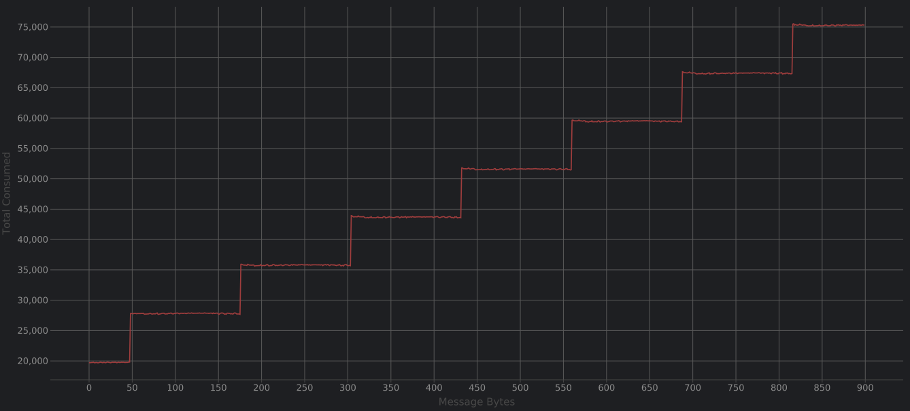

# Solana ED25519 Signature Verification Helper Functions

Pretty self-explanatory. Quite a bit more expensive than the precompile program,
but also quite a bit easier to use with no ix sysvar shenanigans necessary.

--- 

## Compute Costs

See compute-usage.csv, or just look at the chart directly below for the compute costs per message length.

